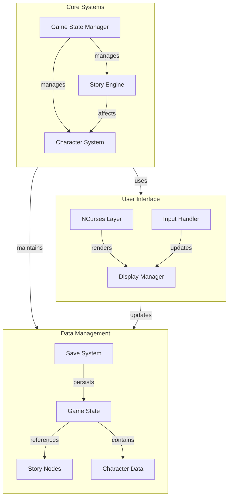
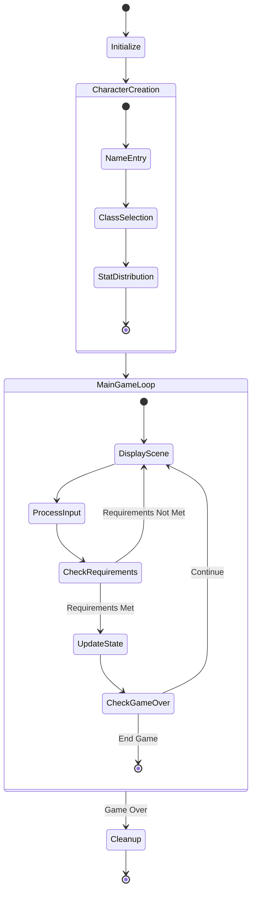
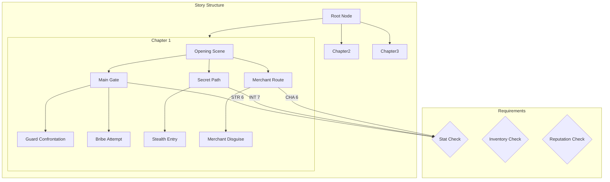

# The Chronicles of Destiny

A text-based RPG game written in C featuring dynamic storytelling, character development, and choice-based gameplay with ncurses-based UI.

## Table of Contents
- [Overview](#overview)
- [Features](#features)
- [System Requirements](#system-requirements)
- [Installation](#installation)
- [Architecture](#architecture)
  - [Component Overview](#component-overview)
  - [Game Flow](#game-flow)
  - [Story System](#story-system)
- [Technical Details](#technical-details)
- [Development](#development)

## Overview

The Chronicles of Destiny is an interactive narrative game where players' choices shape the story's progression. The game features a rich character creation system, stat-based choices, and a colorful ncurses-based user interface.

## Features

- **Character Creation System**
  - Multiple character classes (Warrior, Scholar, Diplomat, Rogue)
  - Unique stat distributions for each class
  - Custom character naming

- **Dynamic Story System**
  - Branching narrative paths
  - Stat-based choices
  - Multiple story outcomes
  - Consequence system

- **Modern Terminal UI**
  - Color-coded interface using ncurses
  - Clear visual feedback for player choices
  - Stat requirement indicators
  - Centered text and professional layout

## System Requirements

- GCC compiler
- Make build system
- ncurses library (version 5+)
- POSIX-compliant operating system
- Terminal with color support

## Installation

1. Install the required dependencies:
   ```bash
   # Ubuntu/Debian
   sudo apt-get install gcc make libncurses5-dev

   # Fedora
   sudo dnf install gcc make ncurses-devel

   # macOS
   brew install ncurses
   ```

2. Clone the repository and build:
   ```bash
   git clone [repository-url]
   cd rpg_game
   make
   ```

3. Run the game:
   ```bash
   ./bin/rpg_game
   ```

## Architecture

### Component Overview



### Game Flow



### Story System



## Technical Details

### Core Systems

1. **Game State Management (`game.h`, `game.c`)**
   - Manages game initialization and cleanup
   - Handles game loop and state transitions
   - Controls UI initialization and color schemes
   ```c
   // Core game loop
   while (!game->isGameOver) {
       displayCurrentScene(game);
       processPlayerChoice(game);
       updateGameState(game);
   }
   ```

2. **Story Engine (`story.h`, `story.c`)**
   - Implements branching narrative system
   - Manages story nodes and transitions
   - Handles choice requirements and consequences
   ```c
   // Story node creation
   StoryNode* node = createStoryNode(id, description);
   addChoice(node, choiceText, nextNode, strReq, intReq, chaReq);
   ```

3. **Character System (`character.h`, `character.c`)**
   - Character creation and customization
   - Stat management and progression
   - Character state persistence

### Color Scheme

The game uses a carefully designed color scheme for maximum readability:
| Element | Color | Usage |
|---------|-------|-------|
| Title text | Yellow | Main titles and headers |
| Headers | Green | Section headers and success messages |
| Normal text | White | Standard narrative text |
| Choices | Cyan | Available player choices |
| Stats | Magenta | Character statistics |
| Errors | Red | Error messages and unmet requirements |

### Data Structures

1. **GameState Structure**
   ```c
   typedef struct GameState {
       Character* player;
       StoryNode* currentScene;
       int currentChapter;
       int reputation;
       int isGameOver;
       char inventory[MAX_INVENTORY_SIZE][50];
       int inventoryCount;
       int choiceHistory[100];
       int choiceHistoryCount;
   } GameState;
   ```

2. **StoryNode Structure**
   ```c
   typedef struct StoryNode {
       int id;
       char description[MAX_DESCRIPTION_LENGTH];
       char choices[MAX_CHOICES][MAX_CHOICE_TEXT];
       int numChoices;
       struct StoryNode* nextNodes[MAX_CHOICES];
       int requirements[MAX_CHOICES][3];
       void (*consequence)(GameState*);
   } StoryNode;
   ```

## Development

### Building the Project

The project uses a Makefile-based build system with the following targets:
```makefile
make        # Build the game
make clean  # Clean build artifacts
make all    # Full rebuild
```

### Adding New Content

1. **Creating New Story Nodes**
   ```c
   // Create a new story branch
   StoryNode* newNode = createStoryNode(id, "Description");
   addChoice(newNode, "Choice text", nextNode, strReq, intReq, chaReq);
   ```

2. **Adding Character Classes**
   - Modify `CHARACTER_CLASS` enum in `character.h`
   - Update stat distribution in `createCharacter()`
   - Add class-specific traits and abilities

### Code Style

The project follows these coding conventions:
- 4-space indentation
- Snake case for function names (`create_story_node`)
- Clear function and variable naming
- Comprehensive error handling
- Memory management best practices

### Memory Management

- All dynamically allocated structures must be properly freed
- Use cleanup functions for each subsystem
- Check for memory leaks using valgrind
- Handle allocation failures gracefully

### Contributing

1. Fork the repository
2. Create a feature branch
3. Make your changes
4. Submit a pull request

Please ensure your code:
- Passes all existing tests
- Includes appropriate documentation
- Follows the established code style
- Handles errors appropriately