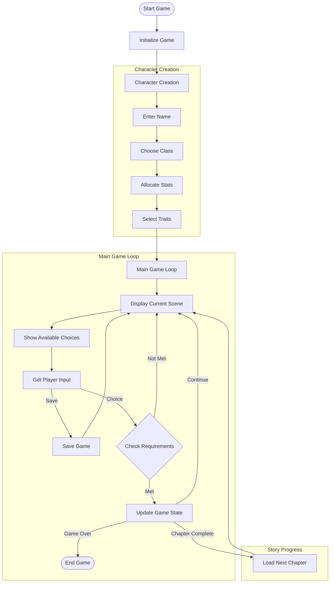
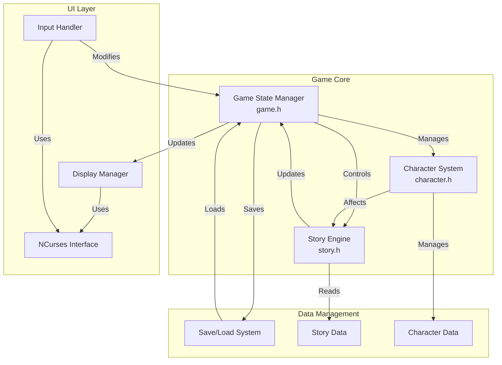
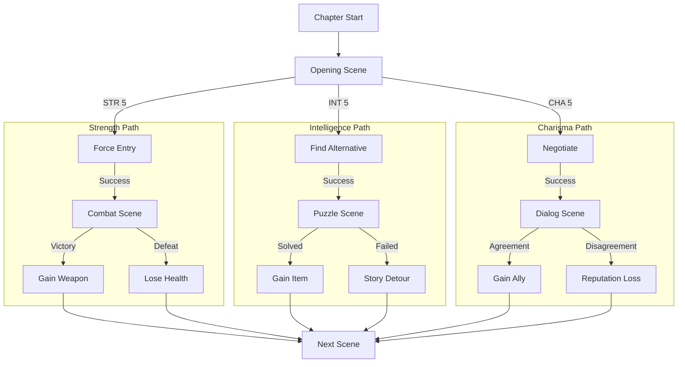

# RPG Game

A text-based role-playing game featuring character creation, branching storylines, and dynamic gameplay based on character stats.

## Features

- **Character Classes**: Choose your path as a Warrior, Scholar, Diplomat, or Rogue
- **Stat-Based Choices**: Your character's attributes influence story decisions
- **Dynamic Inventory**: Collect and manage items throughout your journey
- **Rich Storyline**: Experience a branching narrative across three chapters
- **Save System**: Save your progress and continue your adventure later

## Game Flow



## Technical Architecture



## Story Structure



## Getting Started

### Prerequisites

- GCC compiler
- Make build system
- ncurses library

On Ubuntu/Debian, install the required dependencies:
```bash
sudo apt install gcc make libncurses5-dev
```

### Building the Game

1. Clone the repository:
```bash
git clone [repository-url]
cd rpg_game
```

2. Build the game:
```bash
make clean
make
```

3. Run the game:
```bash
./bin/rpg_game
```

## Gameplay Guide

1. **Character Creation**
   - Choose your character class
   - Allocate stats (Strength, Intelligence, Charisma)
   - Select character traits

2. **Game Controls**
   - Use number keys to select choices
   - Press 'S' to save game
   - Press 'Q' to quit

3. **Stats System**
   - Strength: Affects combat and physical challenges
   - Intelligence: Influences puzzle-solving and knowledge checks
   - Charisma: Determines success in social interactions

## Project Structure

- `src/`: Source code files
  - `character.c`: Character creation and management
  - `game.c`: Core game mechanics
  - `story.c`: Story content and branching logic
- `include/`: Header files
  - `character.h`: Character system definitions
  - `game.h`: Game state and core functions
  - `story.h`: Story system structures
- `bin/`: Compiled executable
- `doc/`: Documentation (generated with Doxygen)

## Documentation

Detailed documentation is available in the `doc/` directory. To generate the documentation:

```bash
doxygen
```

Then open `doc/html/index.html` in your web browser.

## Contributing

1. Fork the repository
2. Create your feature branch (`git checkout -b feature/AmazingFeature`)
3. Commit your changes (`git commit -m 'Add some AmazingFeature'`)
4. Push to the branch (`git push origin feature/AmazingFeature`)
5. Open a Pull Request

## License

This project is licensed under the MIT License - see the LICENSE file for details.

## Acknowledgments

- ncurses library for terminal UI
- Inspiration from classic text-based RPGs